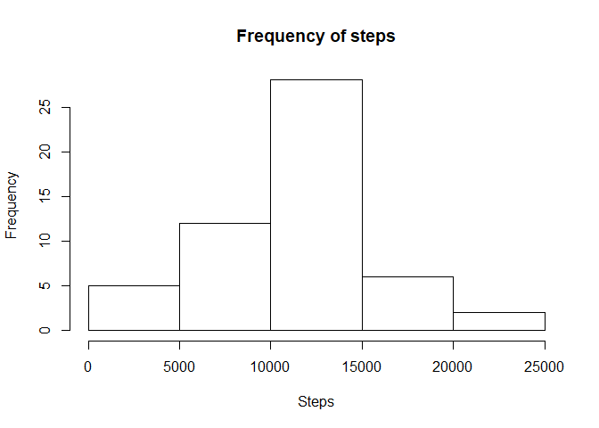
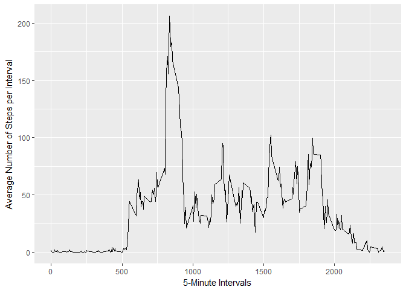
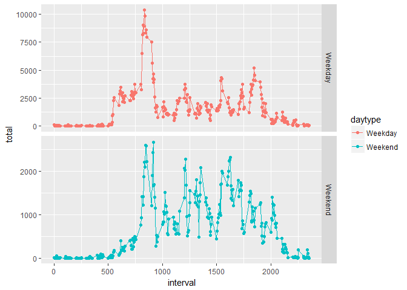

```r
library(ggplot2)
library(dplyr)
library(plyr)
```

## Loading and preprocessing the data

```r
activity.data <- read.csv("activity.csv",header = TRUE, na.strings = "NA")
```


## What is mean total number of steps taken per day?

### Calculate the mean and median of total number of steps taken per day

```r
sum.steps <- ddply(activity.data,.(date),summarize,steps=sum(steps))
hist(sum.steps$steps,main ="Frequency of steps",xlab = "Steps")
```

<!-- -->

```r
mean.data <- ddply(activity.data,.(date),summarize,steps=mean(steps))
mean.data
```

```
##          date      steps
## 1  2012-10-01         NA
## 2  2012-10-02  0.4375000
## 3  2012-10-03 39.4166667
## 4  2012-10-04 42.0694444
## 5  2012-10-05 46.1597222
## 6  2012-10-06 53.5416667
## 7  2012-10-07 38.2465278
## 8  2012-10-08         NA
## 9  2012-10-09 44.4826389
## 10 2012-10-10 34.3750000
## 11 2012-10-11 35.7777778
## 12 2012-10-12 60.3541667
## 13 2012-10-13 43.1458333
## 14 2012-10-14 52.4236111
## 15 2012-10-15 35.2048611
## 16 2012-10-16 52.3750000
## 17 2012-10-17 46.7083333
## 18 2012-10-18 34.9166667
## 19 2012-10-19 41.0729167
## 20 2012-10-20 36.0937500
## 21 2012-10-21 30.6284722
## 22 2012-10-22 46.7361111
## 23 2012-10-23 30.9652778
## 24 2012-10-24 29.0104167
## 25 2012-10-25  8.6527778
## 26 2012-10-26 23.5347222
## 27 2012-10-27 35.1354167
## 28 2012-10-28 39.7847222
## 29 2012-10-29 17.4236111
## 30 2012-10-30 34.0937500
## 31 2012-10-31 53.5208333
## 32 2012-11-01         NA
## 33 2012-11-02 36.8055556
## 34 2012-11-03 36.7048611
## 35 2012-11-04         NA
## 36 2012-11-05 36.2465278
## 37 2012-11-06 28.9375000
## 38 2012-11-07 44.7326389
## 39 2012-11-08 11.1770833
## 40 2012-11-09         NA
## 41 2012-11-10         NA
## 42 2012-11-11 43.7777778
## 43 2012-11-12 37.3784722
## 44 2012-11-13 25.4722222
## 45 2012-11-14         NA
## 46 2012-11-15  0.1423611
## 47 2012-11-16 18.8923611
## 48 2012-11-17 49.7881944
## 49 2012-11-18 52.4652778
## 50 2012-11-19 30.6979167
## 51 2012-11-20 15.5277778
## 52 2012-11-21 44.3993056
## 53 2012-11-22 70.9270833
## 54 2012-11-23 73.5902778
## 55 2012-11-24 50.2708333
## 56 2012-11-25 41.0902778
## 57 2012-11-26 38.7569444
## 58 2012-11-27 47.3819444
## 59 2012-11-28 35.3576389
## 60 2012-11-29 24.4687500
## 61 2012-11-30         NA
```

```r
median.data <- ddply(activity.data,.(date),summarize,steps=median(steps))
median.data
```

```
##          date steps
## 1  2012-10-01    NA
## 2  2012-10-02     0
## 3  2012-10-03     0
## 4  2012-10-04     0
## 5  2012-10-05     0
## 6  2012-10-06     0
## 7  2012-10-07     0
## 8  2012-10-08    NA
## 9  2012-10-09     0
## 10 2012-10-10     0
## 11 2012-10-11     0
## 12 2012-10-12     0
## 13 2012-10-13     0
## 14 2012-10-14     0
## 15 2012-10-15     0
## 16 2012-10-16     0
## 17 2012-10-17     0
## 18 2012-10-18     0
## 19 2012-10-19     0
## 20 2012-10-20     0
## 21 2012-10-21     0
## 22 2012-10-22     0
## 23 2012-10-23     0
## 24 2012-10-24     0
## 25 2012-10-25     0
## 26 2012-10-26     0
## 27 2012-10-27     0
## 28 2012-10-28     0
## 29 2012-10-29     0
## 30 2012-10-30     0
## 31 2012-10-31     0
## 32 2012-11-01    NA
## 33 2012-11-02     0
## 34 2012-11-03     0
## 35 2012-11-04    NA
## 36 2012-11-05     0
## 37 2012-11-06     0
## 38 2012-11-07     0
## 39 2012-11-08     0
## 40 2012-11-09    NA
## 41 2012-11-10    NA
## 42 2012-11-11     0
## 43 2012-11-12     0
## 44 2012-11-13     0
## 45 2012-11-14    NA
## 46 2012-11-15     0
## 47 2012-11-16     0
## 48 2012-11-17     0
## 49 2012-11-18     0
## 50 2012-11-19     0
## 51 2012-11-20     0
## 52 2012-11-21     0
## 53 2012-11-22     0
## 54 2012-11-23     0
## 55 2012-11-24     0
## 56 2012-11-25     0
## 57 2012-11-26     0
## 58 2012-11-27     0
## 59 2012-11-28     0
## 60 2012-11-29     0
## 61 2012-11-30    NA
```


## What is the average daily activity pattern?
###Make a time series plot (i.e. type = "l") of the 5-minute interval (x-axis) and the average number of steps taken, averaged across all days (y-axis)


```r
mean.data<-aggregate(steps ~ interval,data=activity.data,FUN=mean,na.rm=TRUE)


ggplot(mean.data,aes(interval,steps))+geom_line()+xlab("5-Minute Intervals")+ylab("Average Number of Steps per Interval")
```

<!-- -->

###Which 5-minute interval, on average across all the days in the dataset, contains the maximum number of steps?


```r
mean.data[which.max(mean.data$steps),][1]
```

```
##     interval
## 104      835
```

## Imputing missing values
###Calculate and report the total number of missing values in the dataset (i.e. the total number of rows with NAs)


```r
total.NAs <- sum(is.na(activity.data$steps))
```

Total number of rows with NAs = 2304

###Devise a strategy for filling in all of the missing values in the dataset. The strategy does not need to be sophisticated. For example, you could use the mean/median for that day, or the mean for that 5-minute interval, etc.

####Simple approach here is to use average number of steps for the interval that is missing


```r
new.activity.data <- activity.data
new.activity.data[is.na(new.activity.data$steps) == TRUE,]$steps =mean.data$steps[match(mean.data$interval,new.activity.data$interval)]
```

## Are there differences in activity patterns between weekdays and weekends?

```r
new.activity.data$weekend <- weekdays.Date(as.Date(new.activity.data$date))%in%c("Saturday","Sunday")
new.activity.data$daytype <- as.factor(ifelse(new.activity.data$weekend == TRUE,"Weekend","Weekday"))

stepsbyInterval <- ddply(new.activity.data,.(interval,daytype),summarize,total=sum(steps))

ggplot(stepsbyInterval, aes(x=interval, y=total, group=daytype, colour=daytype)) +
   geom_line() + geom_point() +
   facet_grid(daytype ~ ., scales="free_y")
```

<!-- -->
